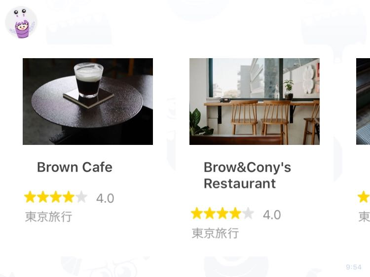

# Sample - Local search

 

```php
$carousel = new FlexCarousel();
$carousel->addContent(
    (new FlexBubble())
        ->setSize(FlexBubbleSize::micro())
        ->setBody(
            (new FlexBox())
                ->setLayout(FlexLayout::vertical())
                ->setPaddingAll('13px')
                ->addContent(
                    (new FlexImage())
                        ->setUrl(new URL('https://scdn.line-apps.com/n/channel_devcenter/img/flexsnapshot/clip/clip10.jpg'))
                        ->setSize(FlexImageSize::full())
                        ->setAspectMode(FlexImageAspectMode::cover())
                        ->setAspectRatio(new FlexImageAspectRatio('320:213'))
                )
                ->addContent(
                    (new FlexBox())
                        ->setLayout(FlexLayout::vertical())
                        ->setSpacing(FlexSpacing::sm())
                        ->setPaddingAll('13px')
                        ->addContent(
                            (new FlexText())
                                ->setText('Brown Cafe')
                                ->setWeight(FlexFontWeight::bold())
                                ->setSize(FlexFontSize::sm())
                                ->setWrap(true)
                        )
                )
                ->addContent(
                    (new FlexBox())
                        ->setLayout(FlexLayout::baseline())
                        ->addContent(
                            (new FlexIcon())
                                ->setUrl(new URL('https://scdn.line-apps.com/n/channel_devcenter/img/fx/review_gold_star_28.png'))
                                ->setSize(FlexIconSize::xs())
                        )
                        ->addContent(
                            (new FlexIcon())
                                ->setUrl(new URL('https://scdn.line-apps.com/n/channel_devcenter/img/fx/review_gold_star_28.png'))
                                ->setSize(FlexIconSize::xs())
                        )
                        ->addContent(
                            (new FlexIcon())
                                ->setUrl(new URL('https://scdn.line-apps.com/n/channel_devcenter/img/fx/review_gold_star_28.png'))
                                ->setSize(FlexIconSize::xs())
                        )
                        ->addContent(
                            (new FlexIcon())
                                ->setUrl(new URL('https://scdn.line-apps.com/n/channel_devcenter/img/fx/review_gold_star_28.png'))
                                ->setSize(FlexIconSize::xs())
                        )
                        ->addContent(
                            (new FlexIcon())
                                ->setUrl(new URL('https://scdn.line-apps.com/n/channel_devcenter/img/fx/review_gray_star_28.png'))
                                ->setSize(FlexIconSize::xs())
                        )
                        ->addContent(
                            (new FlexText())
                                ->setText('4.0')
                                ->setSize(FlexFontSize::xs())
                                ->setColor(FlexColor::hex('#8c8c8c'))
                                ->setMargin(FlexMargin::md())
                                ->setFlex(0)
                        )
                )
                ->addContent(
                    (new FlexBox())
                        ->setLayout(FlexLayout::vertical())
                        ->addContent(
                            (new FlexBox())
                                ->setLayout(FlexLayout::baseline())
                                ->setSpacing(FlexSpacing::sm())
                                ->addContent(
                                    (new FlexText())
                                        ->setText('東京旅行')
                                        ->setWrap(true)
                                        ->setColor(FlexColor::hex('#8c8c8c'))
                                        ->setSize(FlexFontSize::xs())
                                        ->setFlex(5)
                                )
                        )
                )
        )
);
$carousel->addContent(
    (new FlexBubble())
        ->setSize(FlexBubbleSize::micro())
        ->setBody(
            (new FlexBox())
                ->setLayout(FlexLayout::vertical())
                ->setPaddingAll('13px')
                ->addContent(
                    (new FlexImage())
                        ->setUrl(new URL('https://scdn.line-apps.com/n/channel_devcenter/img/flexsnapshot/clip/clip11.jpg'))
                        ->setSize(FlexImageSize::full())
                        ->setAspectMode(FlexImageAspectMode::cover())
                        ->setAspectRatio(new FlexImageAspectRatio('320:213'))
                )
                ->addContent(
                    (new FlexBox())
                        ->setLayout(FlexLayout::vertical())
                        ->setSpacing(FlexSpacing::sm())
                        ->setPaddingAll('13px')
                        ->addContent(
                            (new FlexText())
                                ->setText('Brow&Cony\'s Restaurant')
                                ->setWeight(FlexFontWeight::bold())
                                ->setSize(FlexFontSize::sm())
                                ->setWrap(true)
                        )
                )
                ->addContent(
                    (new FlexBox())
                        ->setLayout(FlexLayout::baseline())
                        ->addContent(
                            (new FlexIcon())
                                ->setUrl(new URL('https://scdn.line-apps.com/n/channel_devcenter/img/fx/review_gold_star_28.png'))
                                ->setSize(FlexIconSize::xs())
                        )
                        ->addContent(
                            (new FlexIcon())
                                ->setUrl(new URL('https://scdn.line-apps.com/n/channel_devcenter/img/fx/review_gold_star_28.png'))
                                ->setSize(FlexIconSize::xs())
                        )
                        ->addContent(
                            (new FlexIcon())
                                ->setUrl(new URL('https://scdn.line-apps.com/n/channel_devcenter/img/fx/review_gold_star_28.png'))
                                ->setSize(FlexIconSize::xs())
                        )
                        ->addContent(
                            (new FlexIcon())
                                ->setUrl(new URL('https://scdn.line-apps.com/n/channel_devcenter/img/fx/review_gold_star_28.png'))
                                ->setSize(FlexIconSize::xs())
                        )
                        ->addContent(
                            (new FlexIcon())
                                ->setUrl(new URL('https://scdn.line-apps.com/n/channel_devcenter/img/fx/review_gray_star_28.png'))
                                ->setSize(FlexIconSize::xs())
                        )
                        ->addContent(
                            (new FlexText())
                                ->setText('4.0')
                                ->setSize(FlexFontSize::xs())
                                ->setColor(FlexColor::hex('#8c8c8c'))
                                ->setMargin(FlexMargin::md())
                                ->setFlex(0)
                        )
                )
                ->addContent(
                    (new FlexBox())
                        ->setLayout(FlexLayout::vertical())
                        ->addContent(
                            (new FlexBox())
                                ->setLayout(FlexLayout::baseline())
                                ->setSpacing(FlexSpacing::sm())
                                ->addContent(
                                    (new FlexText())
                                        ->setText('東京旅行')
                                        ->setWrap(true)
                                        ->setColor(FlexColor::hex('#8c8c8c'))
                                        ->setSize(FlexFontSize::xs())
                                        ->setFlex(5)
                                )
                        )
                )
        )
);
$carousel->addContent(
    (new FlexBubble())
        ->setSize(FlexBubbleSize::micro())
        ->setBody(
            (new FlexBox())
                ->setLayout(FlexLayout::vertical())
                ->setPaddingAll('13px')
                ->addContent(
                    (new FlexImage())
                        ->setUrl(new URL('https://scdn.line-apps.com/n/channel_devcenter/img/flexsnapshot/clip/clip12.jpg'))
                        ->setSize(FlexImageSize::full())
                        ->setAspectMode(FlexImageAspectMode::cover())
                        ->setAspectRatio(new FlexImageAspectRatio('320:213'))
                )
                ->addContent(
                    (new FlexBox())
                        ->setLayout(FlexLayout::vertical())
                        ->setSpacing(FlexSpacing::sm())
                        ->setPaddingAll('13px')
                        ->addContent(
                            (new FlexText())
                                ->setText('Tata')
                                ->setWeight(FlexFontWeight::bold())
                                ->setSize(FlexFontSize::sm())
                                ->setWrap(true)
                        )
                )
                ->addContent(
                    (new FlexBox())
                        ->setLayout(FlexLayout::baseline())
                        ->addContent(
                            (new FlexIcon())
                                ->setUrl(new URL('https://scdn.line-apps.com/n/channel_devcenter/img/fx/review_gold_star_28.png'))
                                ->setSize(FlexIconSize::xs())
                        )
                        ->addContent(
                            (new FlexIcon())
                                ->setUrl(new URL('https://scdn.line-apps.com/n/channel_devcenter/img/fx/review_gold_star_28.png'))
                                ->setSize(FlexIconSize::xs())
                        )
                        ->addContent(
                            (new FlexIcon())
                                ->setUrl(new URL('https://scdn.line-apps.com/n/channel_devcenter/img/fx/review_gold_star_28.png'))
                                ->setSize(FlexIconSize::xs())
                        )
                        ->addContent(
                            (new FlexIcon())
                                ->setUrl(new URL('https://scdn.line-apps.com/n/channel_devcenter/img/fx/review_gold_star_28.png'))
                                ->setSize(FlexIconSize::xs())
                        )
                        ->addContent(
                            (new FlexIcon())
                                ->setUrl(new URL('https://scdn.line-apps.com/n/channel_devcenter/img/fx/review_gray_star_28.png'))
                                ->setSize(FlexIconSize::xs())
                        )
                        ->addContent(
                            (new FlexText())
                                ->setText('4.0')
                                ->setSize(FlexFontSize::xs())
                                ->setColor(FlexColor::hex('#8c8c8c'))
                                ->setMargin(FlexMargin::md())
                                ->setFlex(0)
                        )
                )
                ->addContent(
                    (new FlexBox())
                        ->setLayout(FlexLayout::vertical())
                        ->addContent(
                            (new FlexBox())
                                ->setLayout(FlexLayout::baseline())
                                ->setSpacing(FlexSpacing::sm())
                                ->addContent(
                                    (new FlexText())
                                        ->setText('東京旅行')
                                        ->setWrap(true)
                                        ->setColor(FlexColor::hex('#8c8c8c'))
                                        ->setSize(FlexFontSize::xs())
                                        ->setFlex(5)
                                )
                        )
                )
        )
);
```