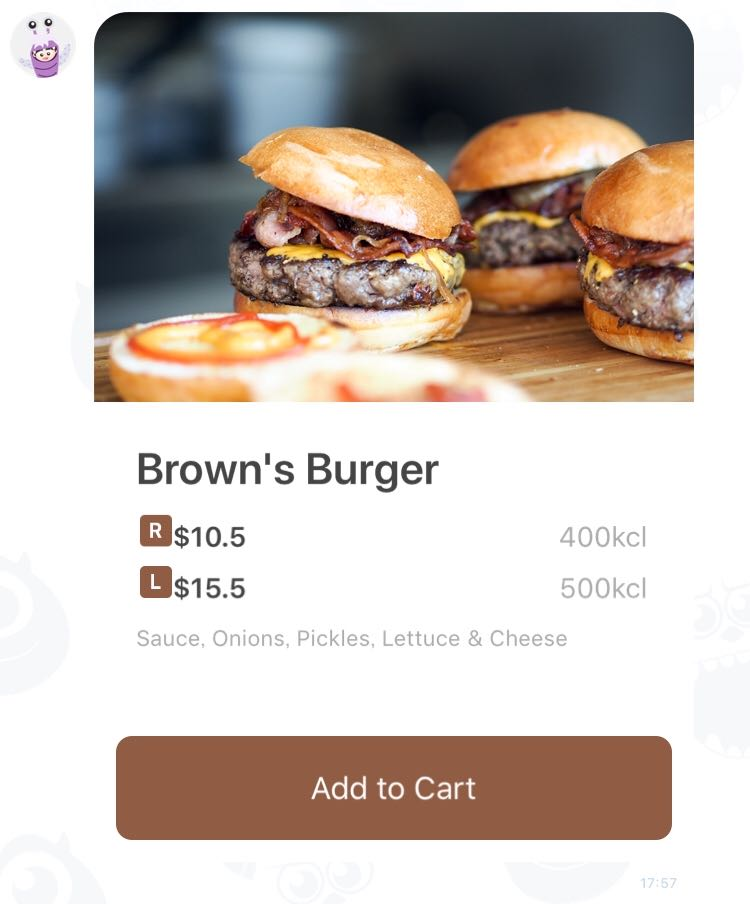

# Sample - Menu

 

```php
$bubble = new FlexBubble();
$bubble
    ->setHero(
        FlexImage::image('https://scdn.line-apps.com/n/channel_devcenter/img/fx/01_2_restaurant.png')
            ->setSize(new FlexImageSize(FlexImageSize::FULL))
            ->setAspectRatio(new FlexImageAspectRatio(FlexImageAspectRatio::ASPECT_20TO13))
            ->setAspectMode(new FlexImageAspectMode(FlexImageAspectMode::MODE_COVER))
            ->setAction(
                new ConversationUrlAction('OPEN', new URL('http://linecorp.com/'))
            )
    )
    ->setBody(
        FlexBox::vertical()
            ->setSpacing(FlexSpacing::md())
            ->setAction(
                new ConversationUrlAction('Add to Cart', new URL('http://linecorp.com/'))
            )
            ->addContent(
                FlexText::text('Brown\'s Burger')
                    ->setSize(FlexFontSize::xl())
                    ->setWeight(FlexFontWeight::bold())
            )
            ->addContent(
                FlexBox::vertical()
                    ->setSpacing(FlexSpacing::sm())
                    ->addContent(
                        FlexBox::baseline()
                            ->addContent(
                                FlexIcon::icon('https://scdn.line-apps.com/n/channel_devcenter/img/fx/restaurant_regular_32.png')
                            )
                            ->addContent(
                                FlexText::text('$10.5')
                                    ->setWeight(FlexFontWeight::bold())
                                    ->setSize(FlexFontSize::sm())
                                    ->setFlex(0)
                            )
                            ->addContent(
                                FlexText::text('400kcl')
                                        ->setSize(FlexFontSize::sm())
                                        ->setAlign(FlexAlign::end())
                                        ->setColor(FlexColor::hex('#aaaaaa'))
                            )
                    )
                    ->addContent(
                        FlexBox::baseline()
                            ->addContent(
                                FlexIcon::icon('https://scdn.line-apps.com/n/channel_devcenter/img/fx/restaurant_large_32.png')
                            )
                            ->addContent(
                                FlexText::text('$15.5')
                                        ->setWeight(FlexFontWeight::bold())
                                        ->setSize(FlexFontSize::sm())
                                        ->setFlex(0)
                            )
                            ->addContent(
                                FlexText::text('500kcl')
                                        ->setSize(FlexFontSize::sm())
                                        ->setAlign(FlexAlign::end())
                                        ->setColor(FlexColor::hex('#aaaaaa'))
                            )
                    )
            )
            ->addContent(
                FlexText::text('Sauce, Onions, Pickles, Lettuce & Cheese')
                    ->setWrap(true)
                    ->setColor(FlexColor::hex('#aaaaaa'))
                    ->setSize(FlexFontSize::xxs())
            )
    )
    ->setFooter(
        FlexBox::vertical()
            ->addContent(FlexSpacer::xxl())
            ->addContent(
                FlexButton::primary()
                    ->setColor(FlexColor::hex('#905c44'))
                    ->setAction(
                        new ConversationUrlAction('Add to Cart', new URL('http://linecorp.com/'))
                    )
            )
    );
```