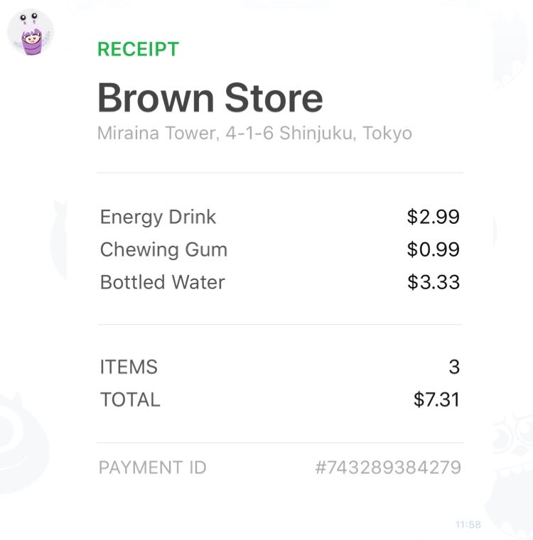

# Sample - Receipt

 

```php
$bubble = new FlexBubble();
$bubble
    ->setStyles(
        (new FlexBubbleStyle())
            ->setFooter(
                (new FlexBlockStyle())
                    ->setSeparator(true)
            )
    )
    ->setBody(
        FlexBox::vertical()
            ->addContent(
                FlexText::text('RECEIPT')
                    ->setWeight(FlexFontWeight::bold())
                    ->setColor(FlexColor::hex('#1DB446'))
                    ->setSize(FlexFontSize::sm())
            )
            ->addContent(
                FlexText::text('Brown Store')
                    ->setWeight(FlexFontWeight::bold())
                    ->setSize(FlexFontSize::xxl())
                    ->setMargin(FlexMargin::md())
            )
            ->addContent(
                FlexText::text('Miraina Tower, 4-1-6 Shinjuku, Tokyo')
                    ->setColor(FlexColor::hex('#aaaaaa'))
                    ->setSize(FlexFontSize::xs())
                    ->setWrap(true)
            )
            ->addContent(
                (new FlexSeparator())
                    ->setMargin(FlexMargin::xxl())
            )
            ->addContent(
                FlexBox::vertical()
                    ->setMargin(FlexMargin::xxl())
                    ->setSpacing(FlexSpacing::sm())
                    ->addContent(
                        (new FlexBox())
                            ->addContent(
                                FlexText::text('Energy Drink')
                                    ->setSize(FlexFontSize::sm())
                                    ->setColor(FlexColor::hex('#555555'))
                                    ->setFlex(0)
                            )
                            ->addContent(
                                FlexText::text('$2.99')
                                    ->setSize(FlexFontSize::sm())
                                    ->setColor(FlexColor::hex('#111111'))
                                    ->setAlign(FlexAlign::end())
                            )
                    )
                    ->addContent(
                        (new FlexBox())
                            ->addContent(
                                FlexText::text('Chewing Gum')
                                    ->setSize(FlexFontSize::sm())
                                    ->setColor(FlexColor::hex('#555555'))
                                    ->setFlex(0)
                            )
                            ->addContent(
                                FlexText::text('$0.99')
                                    ->setSize(FlexFontSize::sm())
                                    ->setColor(FlexColor::hex('#111111'))
                                    ->setAlign(FlexAlign::end())
                            )
                    )
                    ->addContent(
                        (new FlexBox())
                            ->addContent(
                                FlexText::text('Bottled Water')
                                    ->setSize(FlexFontSize::sm())
                                    ->setColor(FlexColor::hex('#555555'))
                                    ->setFlex(0)
                            )
                            ->addContent(
                                FlexText::text('$3.33')
                                    ->setSize(FlexFontSize::sm())
                                    ->setColor(FlexColor::hex('#111111'))
                                    ->setAlign(FlexAlign::end())
                            )
                    )
                    ->addContent(
                        (new FlexSeparator())
                            ->setMargin(FlexMargin::xxl())
                    )
                    ->addContent(
                        (new FlexBox())
                            ->setMargin(FlexMargin::xxl())
                            ->addContent(
                                FlexText::text('ITEMS')
                                    ->setSize(FlexFontSize::sm())
                                    ->setColor(FlexColor::hex('#555555'))
                            )
                            ->addContent(
                                FlexText::text('3')
                                    ->setSize(FlexFontSize::sm())
                                    ->setColor(FlexColor::hex('#111111'))
                                    ->setAlign(FlexAlign::end())
                            )
                    )
                    ->addContent(
                        (new FlexBox())
                            ->addContent(
                                FlexText::text('TOTAL')
                                    ->setSize(FlexFontSize::sm())
                                    ->setColor(FlexColor::hex('#555555'))
                            )
                            ->addContent(
                                FlexText::text('$7.31')
                                    ->setSize(FlexFontSize::sm())
                                    ->setColor(FlexColor::hex('#111111'))
                                    ->setAlign(FlexAlign::end())
                            )
                    )
            )
            ->addContent(
                (new FlexSeparator())
                    ->setMargin(FlexMargin::xxl())
            )
            ->addContent(
                (new FlexBox())
                    ->setMargin(FlexMargin::md())
                    ->addContent(
                        FlexText::text('PAYMENT ID')
                            ->setSize(FlexFontSize::xs())
                            ->setColor(FlexColor::hex('#aaaaaa'))
                            ->setFlex(0)
                    )
                    ->addContent(
                        FlexText::text('#743289384279')
                            ->setSize(FlexFontSize::xs())
                            ->setColor(FlexColor::hex('#aaaaaa'))
                            ->setAlign(FlexAlign::end())
                    )
            )
    );
```