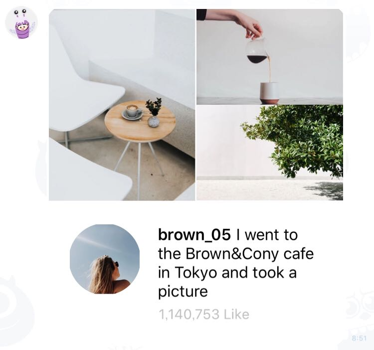

# Sample - Social

 

```php
$bubble = new FlexBubble();
$bubble
    ->setBody(
        (new FlexBox())
            ->setLayout(new FlexLayout(FlexLayout::VERTICAL))
            ->setPaddingAll('0px')
            ->addContent(
                (new FlexBox())
                    ->setLayout(new FlexLayout(FlexLayout::HORIZONTAL))
                    ->addContent(
                        (new FlexImage())
                            ->setUrl(new URL('https://scdn.line-apps.com/n/channel_devcenter/img/flexsnapshot/clip/clip7.jpg'))
                            ->setSize(FlexImageSize::xxxxxl())
                            ->setAspectMode(FlexImageAspectMode::cover())
                            ->setAspectRatio(new FlexImageAspectRatio('150:196'))
                            ->setGravity(FlexGravity::center())
                            ->setFlex(1)
                    )
                    ->addContent(
                        (new FlexBox())
                            ->setLayout(new FlexLayout(FlexLayout::VERTICAL))
                            ->addContent(
                                (new FlexImage())
                                    ->setUrl(new URL('https://scdn.line-apps.com/n/channel_devcenter/img/flexsnapshot/clip/clip8.jpg'))
                                    ->setSize(FlexImageSize::full())
                                    ->setAspectMode(FlexImageAspectMode::cover())
                                    ->setAspectRatio(new FlexImageAspectRatio('150:98'))
                                    ->setGravity(FlexGravity::center())
                            )
                            ->addContent(
                                (new FlexImage())
                                    ->setUrl(new URL('https://scdn.line-apps.com/n/channel_devcenter/img/flexsnapshot/clip/clip9.jpg'))
                                    ->setSize(FlexImageSize::full())
                                    ->setAspectMode(FlexImageAspectMode::cover())
                                    ->setAspectRatio(new FlexImageAspectRatio('150:98'))
                                    ->setGravity(FlexGravity::center())
                            )
                    )
            )
            ->addContent(
                (new FlexBox())
                    ->setLayout(new FlexLayout(FlexLayout::HORIZONTAL))
                    ->setSpacing(FlexSpacing::xl())
                    ->setPaddingAll('20px')
                    ->addContent(
                        (new FlexBox())
                            ->setLayout(new FlexLayout(FlexLayout::VERTICAL))
                            ->setCornerRadius('100px')
                            ->setWidth('72px')
                            ->setHeight('72px')
                            ->addContent(
                                (new FlexImage())
                                    ->setUrl(new URL('https://scdn.line-apps.com/n/channel_devcenter/img/flexsnapshot/clip/clip13.jpg'))
                                    ->setAspectMode(FlexImageAspectMode::cover())
                                    ->setSize(FlexImageSize::full())
                            )
                    )
                    ->addContent(
                        (new FlexBox())
                            ->setLayout(new FlexLayout(FlexLayout::VERTICAL))
                            ->addContent(
                                (new FlexText())
                                    ->setSize(FlexFontSize::sm())
                                    ->setWrap(true)
                                    ->addContent(
                                        (new FlexSpan())
                                            ->setText('brown_05')
                                            ->setWeight(FlexFontWeight::bold())
                                            ->setColor(FlexColor::hex('#000000'))
                                    )
                                    ->addContent(
                                        (new FlexSpan())
                                            ->setText(' ')
                                    )
                                    ->addContent(
                                        (new FlexSpan())
                                            ->setText('I went to the Brown&Cony cafe in Tokyo and took a picture')
                                    )
                            )
                            ->addContent(
                                (new FlexBox())
                                    ->setLayout(FlexLayout::baseline())
                                    ->setSpacing(FlexSpacing::sm())
                                    ->setMargin(FlexMargin::sm())
                                    ->addContent(
                                        (new FlexText())
                                            ->setText('1,140,753 Like')
                                            ->setSize(FlexFontSize::sm())
                                            ->setColor(FlexColor::hex('#bcbcbc'))
                                            ->setWrap(true)
                                    )
                            )
                    )
            )
    );
```