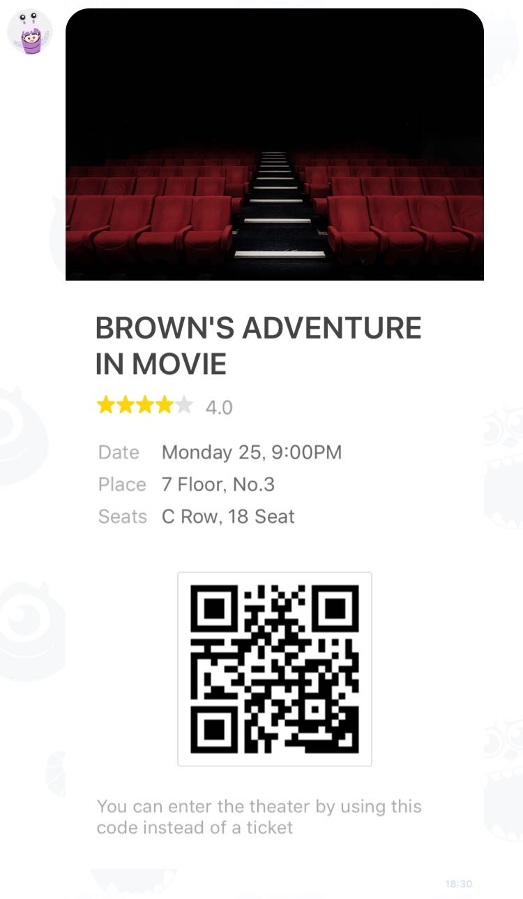

# Sample - Ticket

 

```php
$bubble = new FlexBubble();
$bubble
    ->setHero(
        FlexImage::image('https://scdn.line-apps.com/n/channel_devcenter/img/fx/01_3_movie.png')
                 ->setSize(new FlexImageSize(FlexImageSize::FULL))
                 ->setAspectRatio(new FlexImageAspectRatio(FlexImageAspectRatio::ASPECT_20TO13))
                 ->setAspectMode(new FlexImageAspectMode(FlexImageAspectMode::MODE_COVER))
                 ->setAction(
                     new ConversationUrlAction('OPEN', new URL('http://linecorp.com/'))
                 )
    )
    ->setBody(
        (new FlexBox())
            ->setLayout(new FlexLayout(FlexLayout::VERTICAL))
            ->addContent(
                (new FlexText())
                    ->setText('BROWN\'S ADVENTURE IN MOVIE')
                    ->setWrap(true)
                    ->setWeight(new FlexFontWeight(FlexFontWeight::BOLD))
                    ->setGravity(FlexGravity::center())
                    ->setSize(new FlexFontSize(FlexFontSize::XL))
            )
            ->addContent(
                (new FlexBox())
                    ->setLayout(new FlexLayout(FlexLayout::BASELINE))
                    ->setMargin(new FlexMargin(FlexMargin::MD))
                    ->addContent(
                        (new FlexIcon())
                            ->setUrl(new URL('https://scdn.line-apps.com/n/channel_devcenter/img/fx/review_gold_star_28.png'))
                            ->setSize(new FlexIconSize(FlexIconSize::SM))
                    )
                    ->addContent(
                        (new FlexIcon())
                            ->setUrl(new URL('https://scdn.line-apps.com/n/channel_devcenter/img/fx/review_gold_star_28.png'))
                            ->setSize(new FlexIconSize(FlexIconSize::SM))
                    )
                    ->addContent(
                        (new FlexIcon())
                            ->setUrl(new URL('https://scdn.line-apps.com/n/channel_devcenter/img/fx/review_gold_star_28.png'))
                            ->setSize(new FlexIconSize(FlexIconSize::SM))
                    )
                    ->addContent(
                        (new FlexIcon())
                            ->setUrl(new URL('https://scdn.line-apps.com/n/channel_devcenter/img/fx/review_gold_star_28.png'))
                            ->setSize(new FlexIconSize(FlexIconSize::SM))
                    )
                    ->addContent(
                        (new FlexIcon())
                            ->setUrl(new URL('https://scdn.line-apps.com/n/channel_devcenter/img/fx/review_gray_star_28.png'))
                            ->setSize(new FlexIconSize(FlexIconSize::SM))
                    )
                    ->addContent(
                        (new FlexText())
                            ->setText('4.0')
                            ->setSize(new FlexFontSize(FlexFontSize::SM))
                            ->setColor(new FlexColor('#999999'))
                            ->setMargin(new FlexMargin(FlexMargin::MD))
                            ->setFlex(0)
                    )
            )
            ->addContent(
                (new FlexBox())
                    ->setLayout(new FlexLayout(FlexLayout::VERTICAL))
                    ->setMargin(new FlexMargin(FlexMargin::LG))
                    ->setSpacing(new FlexSpacing(FlexSpacing::SM))
                    ->addContent(
                        (new FlexBox())
                            ->setLayout(new FlexLayout(FlexLayout::BASELINE))
                            ->setSpacing(new FlexSpacing(FlexSpacing::SM))
                            ->addContent(
                                FlexText::text('Date')
                                        ->setColor(new FlexColor('#aaaaaa'))
                                        ->setSize(new FlexFontSize(FlexFontSize::SM))
                                        ->setFlex(1)
                            )
                            ->addContent(
                                FlexText::text('Monday 25, 9:00PM')
                                        ->setWrap(true)
                                        ->setColor(new FlexColor('#666666'))
                                        ->setSize(new FlexFontSize(FlexFontSize::SM))
                                        ->setFlex(5)
                            )
                    )
                    ->addContent(
                        (new FlexBox())
                            ->setLayout(new FlexLayout(FlexLayout::BASELINE))
                            ->setSpacing(new FlexSpacing(FlexSpacing::SM))
                            ->addContent(
                                FlexText::text('Place')
                                        ->setColor(new FlexColor('#aaaaaa'))
                                        ->setSize(new FlexFontSize(FlexFontSize::SM))
                                        ->setFlex(1)
                            )
                            ->addContent(
                                FlexText::text('7 Floor, No.3')
                                        ->setWrap(true)
                                        ->setColor(new FlexColor('#666666'))
                                        ->setSize(new FlexFontSize(FlexFontSize::SM))
                                        ->setFlex(5)
                            )
                    )
                    ->addContent(
                        (new FlexBox())
                            ->setLayout(new FlexLayout(FlexLayout::BASELINE))
                            ->setSpacing(new FlexSpacing(FlexSpacing::SM))
                            ->addContent(
                                FlexText::text('Seats')
                                        ->setColor(new FlexColor('#aaaaaa'))
                                        ->setSize(new FlexFontSize(FlexFontSize::SM))
                                        ->setFlex(1)
                            )
                            ->addContent(
                                FlexText::text('C Row, 18 Seat')
                                        ->setWrap(true)
                                        ->setColor(new FlexColor('#666666'))
                                        ->setSize(new FlexFontSize(FlexFontSize::SM))
                                        ->setFlex(5)
                            )
                    )
            )
            ->addContent(
                FlexBox::vertical()
                       ->setMargin(FlexMargin::xxl())
                       ->addContent(new FlexSpacer())
                       ->addContent(
                           FlexImage::image('https://scdn.line-apps.com/n/channel_devcenter/img/fx/linecorp_code_withborder.png')
                                    ->setAspectMode(FlexImageAspectMode::cover())
                                    ->setSize(FlexImageSize::xl())
                       )
                       ->addContent(
                           FlexText::text('You can enter the theater by using this code instead of a ticket')
                                   ->setColor(new FlexColor('#aaaaaa'))
                                   ->setWrap(true)
                                   ->setMargin(FlexMargin::xxl())
                                   ->setSize(FlexFontSize::xs())
                       )
            )
    );
```